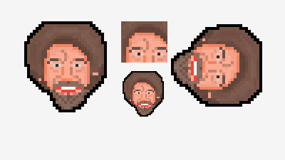
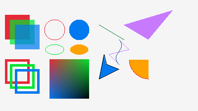
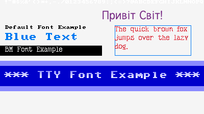
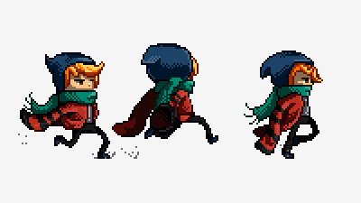

# pntr <a href="https://github.com/robloach/pntr"></a>

Image manipulation library for [C99](https://en.wikipedia.org/wiki/C99_(C_standard_revision)) or C++, with a focus on ease-of-use.

## Usage

``` c
#define PNTR_PIXELFORMAT_RGBA
#define PNTR_IMPLEMENTATION
#include "pntr.h"

int main() {
    pntr_image* image = pntr_new_image(200, 200);
    pntr_draw_circle_fill(image, 100, 100, 80, PNTR_RED);
    pntr_save_image(image, "output.png");
    pntr_unload_image(image);

    return 0;
}
```

## Examples

[](examples/pntr_examples_image.h)
[](examples/pntr_examples_shapes.h)
[](examples/pntr_examples_fonts.h)
[](examples/pntr_examples_sprite.h)

## Integrations

| Name | Description |
| ---- | ----------- |
| [pntr_app](https://github.com/RobLoach/pntr_app) | Application wrapper for building the same pntr code on a number of different platforms |
| [pntr_assetsys](https://github.com/RobLoach/pntr_assetsys) | Load pntr assets from *.zip* files with [assetsys.h](https://github.com/mattiasgustavsson/libs/blob/main/assetsys.h) |
| [pntr_physfs](https://github.com/RobLoach/pntr_physfs) | Load pntr assets from *.zip* files with [PhysicsFS](https://github.com/icculus/physfs) |
| [pntr_nuklear](https://github.com/RobLoach/pntr_nuklear) | [Nuklear](https://github.com/Immediate-Mode-UI/Nuklear) immediate-mode graphical user interface for pntr |
| [pntr_aseprite](https://github.com/RobLoach/pntr_aseprite) | Use [Aseprite](https://github.com/RobLoach/pntr_aseprite) animated sprites in pntr |
| [pntr_tiled](https://github.com/RobLoach/pntr_tiled) | Display [Tiled](https://www.mapeditor.org/) 2D level editor maps in pntr |
| [pntr_portablegl](https://github.com/RobLoach/pntr_portablegl) | Use the OpenGL-esque software rendering library, [PortableGL](https://github.com/rswinkle/PortableGL), in pntr |
| [pntr_doom](https://github.com/RobLoach/pntr_doom) | Play DOOM via [PureDOOM](https://github.com/Daivuk/PureDOOM/) rendered through pntr |
| [pntr_pixelfont](https://github.com/RobLoach/pntr_pixelfont) | Additional pixel fonts outside of the default |

## API

This covers how to use *pntr*.

### Configuration

Add these defines prior to including `pntr.h` to modify how it functions.

| Define | Description |
| --- | --- |
| `PNTR_IMPLEMENTATION` | Define this in one of your `.c` or `.cpp` files before including `pntr.h` |
| `PNTR_PIXELFORMAT_RGBA` | Use the `RGBA` format |
| `PNTR_PIXELFORMAT_ARGB` | Use the `ARGB` pixel format |
| `PNTR_ENABLE_DEFAULT_FONT` | Enables the default font |
| `PNTR_ENABLE_MATH` | Enables use of C's standard [`math.h`](https://en.cppreference.com/w/c/numeric/math) linked library, rather than using the built in math functions |
| `PNTR_ENABLE_TTF` | Enables support for loading [TrueType fonts](https://en.wikipedia.org/wiki/TrueType_fonts) |
| `PNTR_ENABLE_UTF8` | Enables [UTF-8](https://en.wikipedia.org/wiki/UTF-8) support for font loading and text rendering |
| `PNTR_LOAD_FILE` | Callback to use when asked to load a file in `pntr_load_file()`. By default, will use `stdio.h`. |
| `PNTR_LOAD_IMAGE_FROM_MEMORY` | Callback to use when loading an image from memory via `pntr_load_image_from_memory()`. By default, will use  [stb_image](https://github.com/nothings/stb/blob/master/stb_image.h) |
| `PNTR_SAVE_FILE` | Callback to use when saving a file via `pntr_save_file()`. By default, uses `stdio.h` |
| `PNTR_SAVE_IMAGE_TO_MEMORY` | Callback to use when saving an image to memory via `pntr_save_image_to_memory()`. By default, will use [stb_image_write](https://github.com/nothings/stb/blob/master/stb_image_write.h) |
| `PNTR_NO_ALPHABLEND` | Skips alpha blending when drawing pixels |
| `PNTR_NO_STDIO` | Will disable the standard file loading/saving calls for `PNTR_LOAD_FILE` and `PNTR_SAVE_FILE` |
| `PNTR_NO_SAVE_IMAGE` | Disables the default behavior of image saving |
| `PNTR_NO_LOAD_IMAGE` | Disables the default behavior of image loading |
| `PNTR_NO_CUTE_PNG_IMPLEMENTATION` | Skips defining `CUTE_PNG_IMPLEMENTATION`. Useful if you're using cute_png elsewhere |
| `PNTR_NO_STB_TRUETYPE_IMPLEMENTATION` | Skips defining `STB_TRUETYPE_IMPLEMENTATION`. Useful if you're using stb_truetype elsewhere |
| `PNTR_NO_STB_IMAGE_WRITE_IMPLEMENTATION` | Skips defining `STB_IMAGE_WRITE_IMPLEMENTATION`. useful if you're using stb_image_write elsewhere |
| `PNTR_NO_STB_IMAGE_IMPLEMENTATION` | Skips defining `STB_IMAGE_IMPLEMENTATION`. useful if you're using stb_image_write elsewhere |

### Functions

``` c
pntr_image* pntr_new_image(int width, int height);
pntr_image* pntr_gen_image_color(int width, int height, pntr_color color);
pntr_image* pntr_image_copy(pntr_image* image);
pntr_image* pntr_image_from_image(pntr_image* image, int x, int y, int width, int height);
pntr_image* pntr_image_subimage(pntr_image* image, int x, int y, int width, int height);
pntr_rectangle pntr_image_get_clip(pntr_image* image);
void pntr_image_set_clip(pntr_image* image, int x, int y, int width, int height);
void pntr_image_reset_clip(pntr_image* image);
void pntr_unload_image(pntr_image* image);
void pntr_clear_background(pntr_image* image, pntr_color color);

void pntr_draw_point(pntr_image* dst, int x, int y, pntr_color color);
void pntr_draw_point_vec(pntr_image* dst, pntr_vector* point, pntr_color color);
void pntr_draw_points(pntr_image* dst, pntr_vector* points, int pointsCount, pntr_color color);
void pntr_draw_line(pntr_image* dst, int startPosX, int startPosY, int endPosX, int endPosY, pntr_color color);
void pntr_draw_line_horizontal(pntr_image* dst, int posX, int posY, int width, pntr_color color);
void pntr_draw_line_horizontal_thick(pntr_image* dst, int posX, int posY, int width, int thickness, pntr_color color);
void pntr_draw_line_thick(pntr_image* dst, int startPosX, int startPosY, int endPosX, int endPosY, int thickness, pntr_color color);
void pntr_draw_line_thick_vec(pntr_image* dst, pntr_vector start, pntr_vector end, int thickness, pntr_color color);
void pntr_draw_line_vec(pntr_image* dst, pntr_vector start, pntr_vector end, pntr_color color);
void pntr_draw_line_vertical(pntr_image* dst, int posX, int posY, int height, pntr_color color);
void pntr_draw_line_vertical_thick(pntr_image* dst, int posX, int posY, int height, int thickness, pntr_color color);
void pntr_draw_rectangle(pntr_image* dst, int posX, int posY, int width, int height, pntr_color color);
void pntr_draw_rectangle_fill(pntr_image* dst, int posX, int posY, int width, int height, pntr_color color);
void pntr_draw_rectangle_fill_rec(pntr_image* dst, pntr_rectangle rect, pntr_color color);
void pntr_draw_rectangle_gradient(pntr_image* dst, int x, int y, int width, int height, pntr_color topLeft, pntr_color topRight, pntr_color bottomLeft, pntr_color bottomRight);
void pntr_draw_rectangle_gradient_rec(pntr_image* dst, pntr_rectangle rect, pntr_color topLeft, pntr_color topRight, pntr_color bottomLeft, pntr_color bottomRight);
void pntr_draw_rectangle_rec(pntr_image* dst, pntr_rectangle rec, pntr_color color);
void pntr_draw_rectangle_thick(pntr_image* dst, int posX, int posY, int width, int height, int thickness, pntr_color color);
void pntr_draw_rectangle_thick_rec(pntr_image* dst, pntr_rectangle rect, int thickness, pntr_color color);
void pntr_draw_triangle(pntr_image* dst, int x1, int y1, int x2, int y2, int x3, int y3, pntr_color color);
void pntr_draw_triangle_fill(pntr_image* dst, int x1, int y1, int x2, int y2, int x3, int y3, pntr_color color);
void pntr_draw_triangle_fill_vec(pntr_image* dst, pntr_vector point1, pntr_vector point2, pntr_vector point3, pntr_color color);
void pntr_draw_triangle_thick(pntr_image* dst, int x1, int y1, int x2, int y2, int x3, int y3, int thickness, pntr_color color);
void pntr_draw_triangle_thick_vec(pntr_image* dst, pntr_vector point1, pntr_vector point2, pntr_vector point3, int thickness, pntr_color color);
void pntr_draw_triangle_vec(pntr_image* dst, pntr_vector point1, pntr_vector point2, pntr_vector point3, pntr_color color);
void pntr_draw_ellipse(pntr_image* dst, int centerX, int centerY, int radiusX, int radiusY, pntr_color color);
void pntr_draw_ellipse_fill(pntr_image* dst, int centerX, int centerY, int radiusX, int radiusY, pntr_color color);
void pntr_draw_ellipse_thick(pntr_image* dst, int centerX, int centerY, int radiusX, int radiusY, int thickness, pntr_color color);
void pntr_draw_circle(pntr_image* dst, int centerX, int centerY, int radius, pntr_color color);
void pntr_draw_circle_fill(pntr_image* dst, int centerX, int centerY, int radius, pntr_color color);
void pntr_draw_circle_thick(pntr_image* dst, int centerX, int centerY, int radius, int thickness, pntr_color color);
void pntr_draw_polygon(pntr_image* dst, pntr_vector* points, int numPoints, pntr_color color);
void pntr_draw_polygon_fill(pntr_image* dst, pntr_vector* points, int numPoints, pntr_color color);
void pntr_draw_polygon_thick(pntr_image* dst, pntr_vector* points, int numPoints, int thickness, pntr_color color);
void pntr_draw_polyline(pntr_image* dst, pntr_vector* points, int numPoints, pntr_color color);
void pntr_draw_polyline_thick(pntr_image* dst, pntr_vector* points, int numPoints, int thickness, pntr_color color);
void pntr_draw_arc(pntr_image* dst, int centerX, int centerY, float radius, float startAngle, float endAngle, int segments, pntr_color color);
void pntr_draw_arc_fill(pntr_image* dst, int centerX, int centerY, float radius, float startAngle, float endAngle, int segments, pntr_color color);
void pntr_draw_arc_thick(pntr_image* dst, int centerX, int centerY, float radius, float startAngle, float endAngle, int segments, int thickness, pntr_color color);
void pntr_draw_rectangle_rounded(pntr_image* dst, int x, int y, int width, int height, int topLeftRadius, int topRightRadius, int bottomLeftRadius, int bottomRightRadius, pntr_color color);
void pntr_draw_rectangle_rounded_fill(pntr_image* dst, int x, int y, int width, int height, int cornerRadius, pntr_color color);
void pntr_draw_rectangle_thick_rounded(pntr_image* dst, int x, int y, int width, int height, int topLeftRadius, int topRightRadius, int bottomLeftRadius, int bottomRightRadius, int thickness, pntr_color color);
void pntr_draw_image(pntr_image* dst, pntr_image* src, int posX, int posY);
void pntr_draw_image_rec(pntr_image* dst, pntr_image* src, pntr_rectangle srcRect, int posX, int posY);
void pntr_draw_image_tint(pntr_image* dst, pntr_image* src, int posX, int posY, pntr_color tint);
void pntr_draw_image_tint_rec(pntr_image* dst, pntr_image* src, pntr_rectangle srcRect, int posX, int posY, pntr_color tint);
void pntr_draw_image_rotated(pntr_image* dst, pntr_image* src, int posX, int posY, float degrees, float offsetX, float offsetY, pntr_filter filter);
void pntr_draw_image_rotated_rec(pntr_image* dst, pntr_image* src, pntr_rectangle srcRect, int posX, int posY, float degrees, float offsetX, float offsetY, pntr_filter filter);
void pntr_draw_image_flipped(pntr_image* dst, pntr_image* src, int posX, int posY, bool flipHorizontal, bool flipVertical, bool flipDiagonal);
void pntr_draw_image_flipped_rec(pntr_image* dst, pntr_image* src, pntr_rectangle srcRec, int posX, int posY, bool flipHorizontal, bool flipVertical, bool flipDiagonal);
void pntr_draw_image_scaled(pntr_image* dst, pntr_image* src, int posX, int posY, float scaleX, float scaleY, float offsetX, float offsetY, pntr_filter filter);
void pntr_draw_image_scaled_rec(pntr_image* dst, pntr_image* src, pntr_rectangle srcRect, int posX, int posY, float scaleX, float scaleY, float offsetX, float offsetY, pntr_filter filter);
void pntr_draw_text(pntr_image* dst, pntr_font* font, const char* text, int posX, int posY, pntr_color tint);
void pntr_draw_text_len(pntr_image* dst, pntr_font* font, const char* text, int textLength, int posX, int posY, pntr_color tint);
void pntr_draw_text_wrapped(pntr_image* dst, pntr_font* font, const char* text, int posX, int posY, int maxWidth, pntr_color tint);
void pntr_draw_text_ex(pntr_image* dst, pntr_font* font, int posX, int posY, pntr_color tint, const char* text, ...);
pntr_color pntr_new_color(unsigned char r, unsigned char g, unsigned char b, unsigned char a);
pntr_color pntr_get_color(unsigned int hexValue);
unsigned char pntr_color_r(pntr_color color);
unsigned char pntr_color_g(pntr_color color);
unsigned char pntr_color_b(pntr_color color);
unsigned char pntr_color_a(pntr_color color);
void pntr_color_set_r(pntr_color* color, unsigned char r);
void pntr_color_set_g(pntr_color* color, unsigned char g);
void pntr_color_set_b(pntr_color* color, unsigned char b);
void pntr_color_set_a(pntr_color* color, unsigned char a);
pntr_color pntr_image_get_color(pntr_image* image, int x, int y);
bool pntr_save_file(const char *fileName, const void *data, unsigned int bytesToWrite);
void* pntr_image_to_pixelformat(pntr_image* image, unsigned int* dataSize, pntr_pixelformat pixelFormat);
bool pntr_save_image(pntr_image* image, const char* fileName);
unsigned char* pntr_save_image_to_memory(pntr_image* image, pntr_image_type type, unsigned int* dataSize);
int pntr_get_pixel_data_size(int width, int height, pntr_pixelformat pixelFormat);
pntr_image* pntr_load_image(const char* fileName);
pntr_image* pntr_load_image_from_memory(pntr_image_type type, const unsigned char* fileData, unsigned int dataSize);
pntr_image* pntr_image_from_pixelformat(const void* data, int width, int height, pntr_pixelformat pixelFormat);
void* pntr_set_error(pntr_error error);
const char* pntr_get_error(void);
pntr_error pntr_get_error_code(void);
pntr_image* pntr_image_resize(pntr_image* image, int newWidth, int newHeight, pntr_filter filter);
pntr_image* pntr_image_scale(pntr_image* image, float scaleX, float scaleY, pntr_filter filter);
void pntr_image_color_replace(pntr_image* image, pntr_color color, pntr_color replace);
pntr_color pntr_color_tint(pntr_color color, pntr_color tint);
void pntr_image_color_tint(pntr_image* image, pntr_color color);
pntr_color pntr_color_fade(pntr_color color, float alpha);
void pntr_image_color_fade(pntr_image* image, float alpha);
pntr_color pntr_color_brightness(pntr_color color, float factor);
pntr_color pntr_get_pixel_color(void* srcPtr, pntr_pixelformat srcPixelFormat);
void pntr_set_pixel_color(void* dstPtr, pntr_pixelformat dstPixelFormat, pntr_color color);
pntr_font* pntr_load_font_default(void);
void pntr_unload_font(pntr_font* font);
pntr_font* pntr_font_copy(pntr_font* font);
pntr_font* pntr_font_scale(pntr_font* font, float scaleX, float scaleY, pntr_filter filter);
pntr_font* pntr_load_font_bmf(const char* fileName, const char* characters);
pntr_font* pntr_load_font_bmf_from_image(pntr_image* image, const char* characters);
pntr_font* pntr_load_font_bmf_from_memory(const unsigned char* fileData, unsigned int dataSize, const char* characters);
int pntr_measure_text(pntr_font* font, const char* text);
pntr_vector pntr_measure_text_ex(pntr_font* font, const char* text, int textLength);
pntr_image* pntr_gen_image_text(pntr_font* font, const char* text, pntr_color tint, pntr_color backgroundColor);
pntr_font* pntr_load_font_tty(const char* fileName, int glyphWidth, int glyphHeight, const char* characters);
pntr_font* pntr_load_font_tty_from_memory(const unsigned char* fileData, unsigned int dataSize, int glyphWidth, int glyphHeight, const char* characters);
pntr_font* pntr_load_font_tty_from_image(pntr_image* image, int glyphWidth, int glyphHeight, const char* characters);
unsigned char* pntr_load_file(const char *fileName, unsigned int *bytesRead);
void pntr_unload_file(unsigned char* fileData);
const char* pntr_load_file_text(const char *fileName);
void pntr_unload_file_text(const char* text);
pntr_font* pntr_load_font_ttf(const char* fileName, int fontSize);
pntr_font* pntr_load_font_ttf_from_memory(const unsigned char* fileData, unsigned int dataSize, int fontSize);
pntr_color pntr_color_invert(pntr_color color);
void pntr_image_color_invert(pntr_image* image);
pntr_color pntr_color_alpha_blend(pntr_color dst, pntr_color src);
pntr_rectangle pntr_image_alpha_border(pntr_image* image, float threshold);
bool pntr_image_crop(pntr_image* image, int x, int y, int width, int height);
void pntr_image_alpha_crop(pntr_image* image, float threshold);
void pntr_image_color_brightness(pntr_image* image, float factor);
void pntr_image_flip(pntr_image* image, bool horizontal, bool vertical);
pntr_color pntr_color_contrast(pntr_color color, float contrast);
void pntr_image_color_contrast(pntr_image* image, float contrast);
void pntr_image_alpha_mask(pntr_image* image, pntr_image* alphaMask, int posX, int posY);
bool pntr_image_resize_canvas(pntr_image* image, int newWidth, int newHeight, int offsetX, int offsetY, pntr_color fill);
pntr_image* pntr_image_rotate(pntr_image* image, float degrees, pntr_filter filter);
pntr_image* pntr_gen_image_gradient(int width, int height, pntr_color topLeft, pntr_color topRight, pntr_color bottomLeft, pntr_color bottomRight);
pntr_color pntr_color_bilinear_interpolate(pntr_color color00, pntr_color color01, pntr_color color10, pntr_color color11, float coordinateX, float coordinateY);
void* pntr_load_memory(size_t size);
void pntr_unload_memory(void* pointer);
void* pntr_memory_copy(void* destination, void* source, size_t size);
pntr_image_type pntr_get_file_image_type(const char* filePath);
```

## Development

To build the tests and examples, use [CMake](https://cmake.org):

``` bash
# Set up the build files.
cmake -B build

# Build the tests and examples.
cmake --build build

# Run the tests
ctest --test-dir build -V
```

### Documentation

To build the documentation, use [Doxygen](https://www.doxygen.nl)...
``` bash
doxygen .Doxyfile
```

To publish the documentation, [Node.js](https://nodejs.org)...
``` bash
npm run docs
```

## Acknowledgements

- [Logo](https://www.pixilart.com/art/bob-ross-9910c4da4b3a1c8) by [Ravenist](https://www.pixilart.com/ravenist), used with [permission](https://www.reddit.com/r/PixelArt/comments/fi2b1v/oc_felt_a_little_sad_so_i_watched_bob_ross_videos/j6ordqn/)
- [cute_png.h](https://github.com/RandyGaul/cute_headers/blob/master/cute_png.h) by [Randy Gaul](https://github.com/RandyGaul)
- [font8x8](https://github.com/dhepper/font8x8/) by [Daniel Hepper](https://github.com/dhepper) provides the [8x8 monochrome font](https://github.com/dhepper/font8x8/blob/master/font8x8_basic.h)
- [stb_image.h](https://github.com/nothings/stb/blob/master/stb_image.h) by [Sean Barrett](https://github.com/nothings)
- [stb_truetype.h](https://github.com/nothings/stb/blob/master/stb_truetype.h) by [Sean Barrett](https://github.com/nothings)
- [utf8.h](https://github.com/sheredom/utf8.h) by [Neil Henning](https://github.com/sheredom)
- [tester](https://github.com/zpl-c/tester) from [zpl](https://github.com/zpl-c) provides the unit testing framework
- [raylib](https://github.com/raysan5/raylib) inspired some of the design patterns

## License

Unless stated otherwise, all works are:

- Copyright (c) 2023 [Rob Loach](https://robloach.net)

... and licensed under:

- [zlib License](LICENSE.md)
